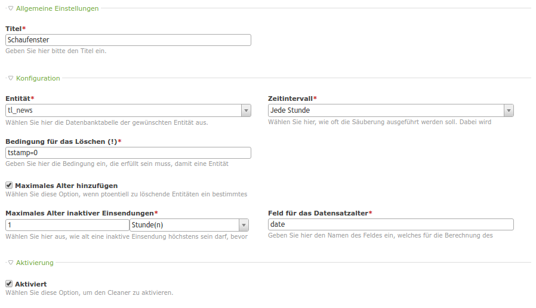

@abandoned - use heimrichhannot/contao-cleaner instead.

# Entity Cleaner

This module adds cleaner functionality for periodically removing arbitrary entities fulfilling a certain condition (using TL_CRON or your server's cron).

*Cleaner configuration*
